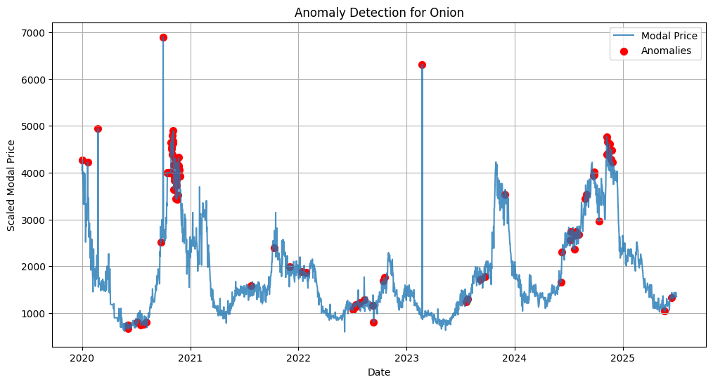
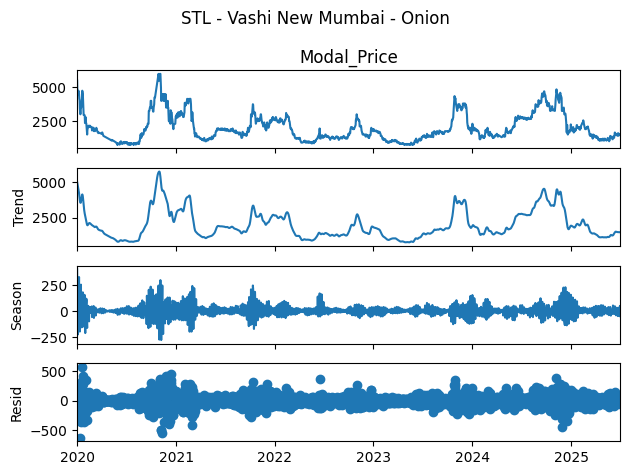

# Commodity Price Intelligence & Market Risk Analytics


## Overview

Agricultural commodity prices can fluctuate significantly across markets due to seasonality, weather conditions, supply-demand imbalances, and local market dynamics. These fluctuations make planning difficult for farmers, traders, and other stakeholders.

In this project, I analyzed over 119,000 agricultural market records across Maharashtra to forecast future commodity prices, identify unusual market behavior, and generate insights that could support better decision-making.

---

## Project Snapshot

* 119,000+ agricultural market records
* 8 commodities
* 36 Maharashtra markets
* Weather-enriched dataset
* Forecasting, anomaly detection, and market risk analysis
* Multiple forecasting approaches evaluated using time-series cross-validation

---

## Business Problem

Commodity markets are inherently volatile. Sudden price spikes and drops can affect procurement decisions, inventory planning, and profitability.

The goal of this project was to answer three key questions:

1. Can future commodity prices be forecasted reliably?
2. Can unusual market behavior be identified automatically?
3. Does forecasting performance vary across different commodities and markets?

---

## How the Analysis Was Performed

The project followed an end-to-end analytics workflow:

* Data cleaning and preprocessing
* Exploratory analysis of commodities and markets
* Weather data integration
* Feature engineering
* Forecasting model development
* Time-series cross-validation
* Model comparison and selection
* Anomaly detection
* Forecast generation and interpretation

# Forecasting Models Evaluated
To compare forecasting performance across different commodity-market combinations, the following approaches were evaluated:

## Statistical Models
* AutoARIMA
* ETS
* Prophet
## Machine Learning Models
* Random Forest
* XGBoost
* Support Vector Regression (SVR)

Rather than applying a single forecasting model across all commodities, the best-performing model was selected for each commodity-market combination based on validation performance.

---

## Price Forecasting

Rather than applying a single forecasting model across all commodities, multiple approaches were evaluated and compared.

The best-performing model was selected for each commodity-market combination based on validation performance.


---

## Anomaly Detection

In addition to forecasting, anomaly detection was used to identify unusual price movements and potential market disruptions.

These anomalies can act as early warning signals and help stakeholders monitor periods of abnormal market behavior.



---

## Seasonality Analysis

Seasonal decomposition (STL) was performed to separate long-term trends, recurring seasonal patterns, and unexplained residual movements.

This helped provide a clearer understanding of the factors influencing commodity prices over time.



---

## What I Found

### No Universal Best Forecasting Model

One of the most interesting findings was that there was no single forecasting model that consistently performed best across all commodities and markets.

### Commodity Characteristics Matter

Model performance varied significantly depending on commodity behavior and market characteristics. Stable commodities often performed well with statistical forecasting techniques, while highly volatile commodities such as onions frequently benefited from machine learning approaches.

### Market anomalies were clearly visible

Several periods of unusual price behavior were identified through anomaly detection, highlighting potential market disruptions and volatility spikes.

### Forecast Uncertainty Is Important

Confidence intervals provided a more realistic representation of future uncertainty and helped frame forecasts as decision-support tools rather than precise predictions.

---

## Business Value

This project demonstrates how analytics can be used to support decision-making in volatile markets.

Potential applications include:

* Price trend monitoring
* Procurement planning
* Market risk assessment
* Inventory planning
* Early identification of unusual market conditions

---

## Technologies & Techniques

### Programming & Analytics
- Python
- Pandas
- NumPy

### Forecasting & Modeling
- Statsmodels
- Prophet
- Scikit-learn
- XGBoost

### Analytical Techniques
- Data Cleaning & Preprocessing
- Exploratory Data Analysis (EDA)
- Time-Series Forecasting
- Time-Series Cross-Validation
- Seasonal Decomposition (STL)
- Anomaly Detection
- Model Evaluation & Selection
- Feature Engineering
- Business Insight Generation

### Visualization
- Matplotlib
- Seaborn

---

## Repository Structure

```text
data/
├── Agri_Market_3Cities_With_Weather.csv

notebooks/
├── forecasting_pipeline.ipynb

outputs/
├── best_model_summary.csv
├── future_forecasts.csv
└── cross_validation_results.csv

images/
├── forecast_onion_ramtek.png
├── anomaly_detection_onion.png
└── stl_vashi_new_mumbai_onion.png

reports/
└── project_report.pdf
```

## Project Context

This project was completed as part of a postgraduate academic team project focused on agricultural market analytics and forecasting.

## My Contribution

My contributions included:

* Data preprocessing and exploratory data analysis
* Weather data integration and feature engineering
* Forecasting model development and evaluation
* Time-series cross-validation
* Anomaly detection analysis
* Forecast generation and interpretation
* Project documentation and presentation preparation
