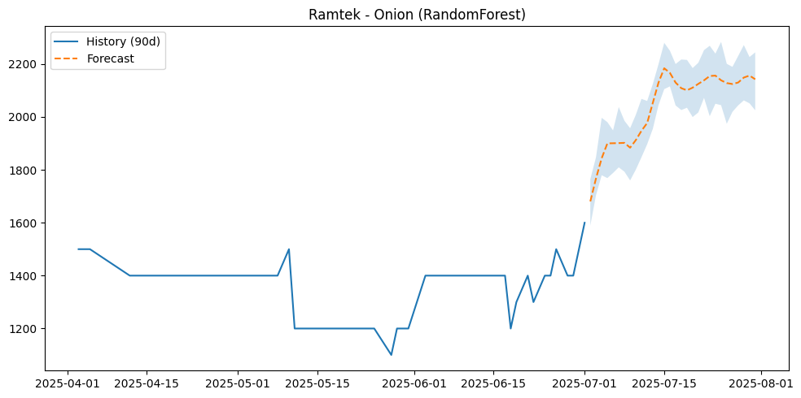

# Commodity Price Intelligence & Market Risk Monitoring Platform

## Overview

Agricultural commodity prices are highly volatile, creating uncertainty for farmers, traders, and policymakers.

This project develops a data-driven market intelligence platform that forecasts future commodity prices, detects unusual market behavior, and generates risk-aware forecasts across Maharashtra agricultural markets.

## Business Problem

Agricultural markets frequently experience sudden price fluctuations due to seasonality, supply-demand imbalances, weather conditions, and market dynamics.

The objective of this project was to develop a system capable of:

* Forecasting future commodity prices
* Detecting anomalous market behavior
* Comparing forecasting approaches
* Generating confidence-aware forecasts
* Supporting data-driven decision making

## Dataset

* 119,000+ market observations
* Multiple agricultural commodities
* Multiple Maharashtra markets
* Weather-enriched data
* Historical price records

## Key Capabilities

* Time Series Forecasting
* Anomaly Detection
* Seasonal Decomposition (STL)
* Cross-Validation Framework
* Model Selection & Evaluation
* Forecast Confidence Intervals

## Repository Structure

data/ – Dataset

notebooks/ – Forecasting pipeline

outputs/ – Forecast results and model summaries

images/ – Key project visualizations

reports/ – Project documentation

presentation/ – Project presentation

## Key Results

* Generated future commodity price forecasts
* Identified anomalous market conditions
* Evaluated multiple forecasting approaches
* Quantified forecast uncertainty using confidence intervals
* Produced market intelligence insights for decision support

## Technologies Used

* Python
* Pandas
* NumPy
* Scikit-learn
* Statsmodels
* Prophet
* XGBoost
* Matplotlib
* Time Series Analysis

## Project Context

This project was completed as part of a postgraduate academic team project.

### My Contribution

To be updated.
